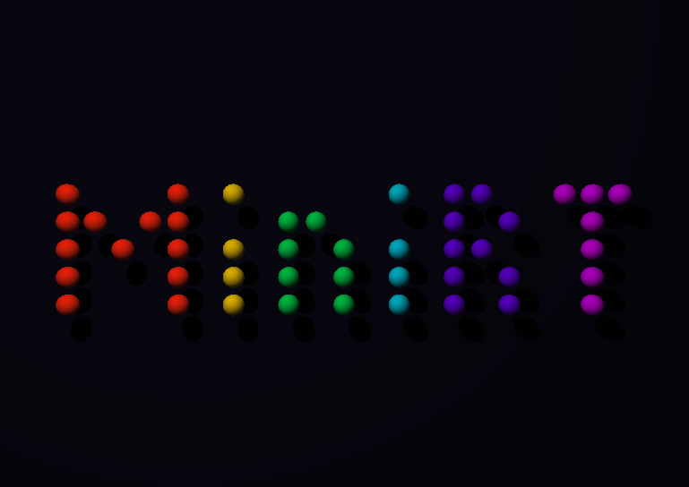
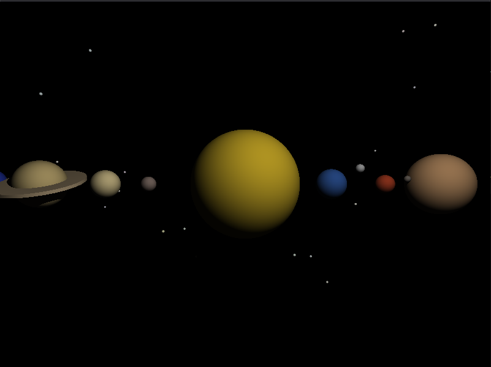
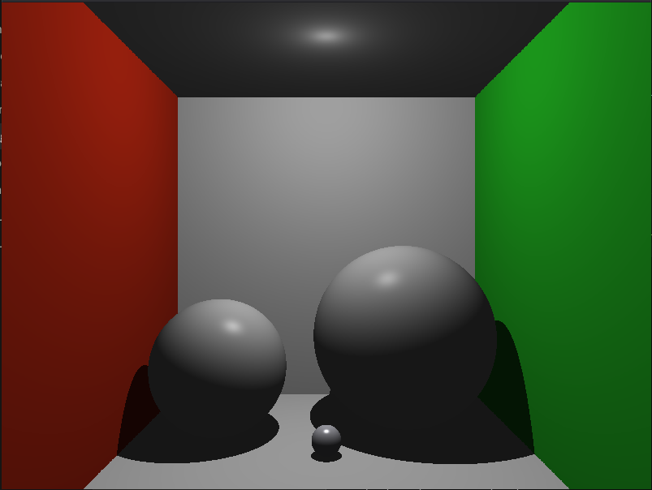
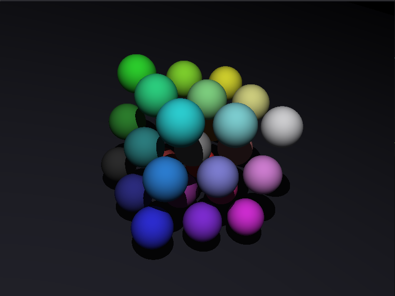
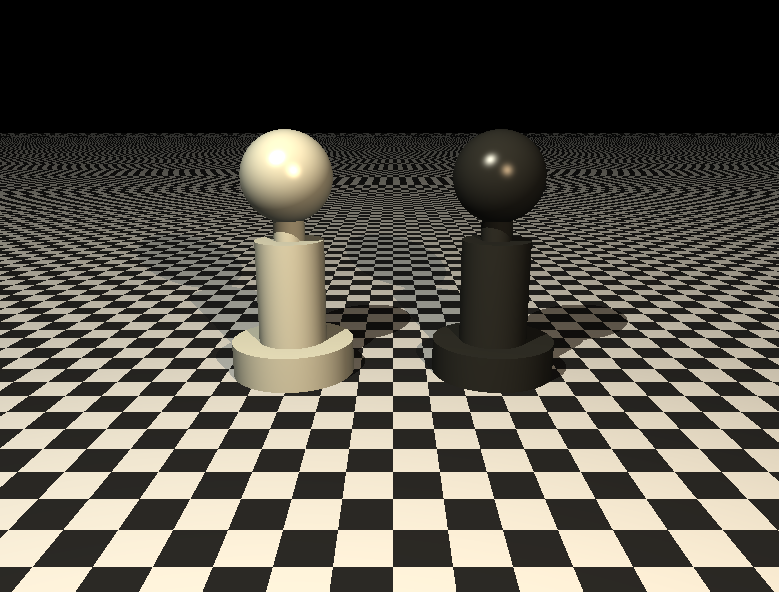
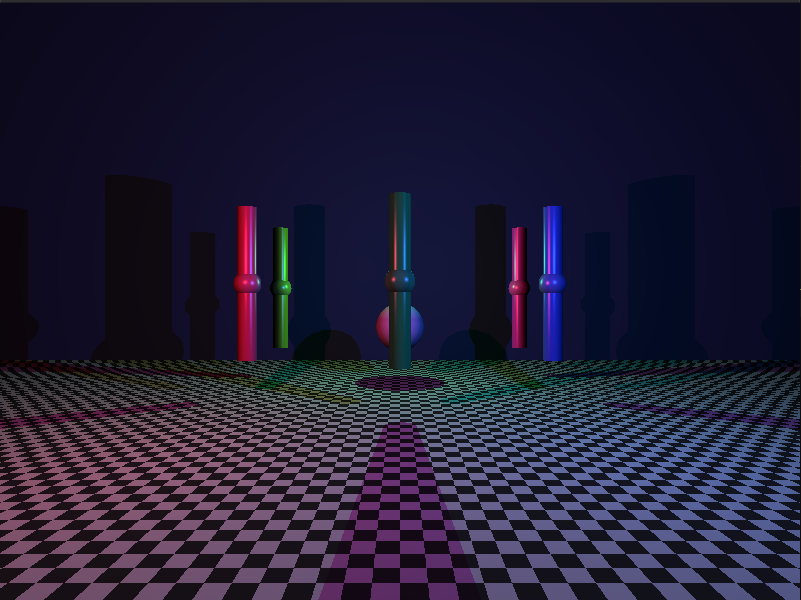
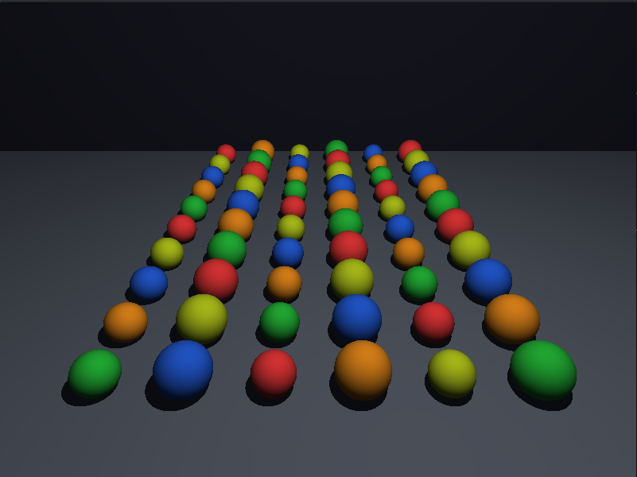

# MiniRT

A raytracer written in C. Renders spheres, planes, cylinders, and cones with lighting, shadows, and bonus features like specular highlights, checkerboard patterns, and bump maps.
<br>
<center><br></center>

## Build & Run

```bash
make                          # mandatory parser
make bonus                    # bonus parser (specular, checker, cones)

./miniRT scenes/scene.rt
./miniRT_bonus scenes/scene.rt
```

## Controls

| Key | Action |
|-----|--------|
| `1/2/3/4` | Switch mode: object move / object rotate / camera move / camera rotate |
| `W A S D` | Move horizontally |
| `↑ ↓` | Move vertically |
| `Tab` | Select next object |
| `T` | Toggle render mode |
| `Esc / Q` | Quit |

## Scenes

<table>
<tr>
<td><br><sub>Solar System</sub></td>
<td><br><sub>Cornell Box</sub></td>
<td><br><sub>Sphere Cube</sub></td>
</tr>
<tr>
<td><br><sub>Chess Pawns</sub></td>
<td><br><sub>Neon Corridor</sub></td>
<td><br><sub>Sea of Spheres</sub></td>
</tr>
</table>

## Scene Format

```
A 0.2 255,255,255               # ambient: ratio R,G,B
C 0,0,20 0,0,0 70               # camera: pos orient(euler) fov
L 5,10,5 0.8                    # light: pos brightness

sp 0,0,0 2 255,100,50           # sphere: pos radius color
pl 0,-1,0 0,1,0 200,200,200     # plane: pos normal color
cy 0,0,0 0,1,0 1 4 100,150,255  # cylinder: pos axis radius height color
```
